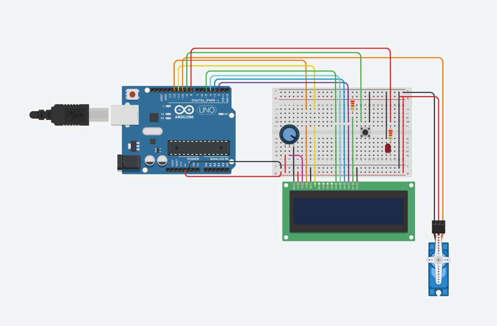

# OxyControl

## What is OxyControl?

Opioid abuse is the leading cause of drug-related death in the United States, and one of the leading preventable causes of death in persons under 50 years of age. Oftentimes, prescription narcotics are the gateway into opioid addiction, and as a result controlling the abuse thereof is a national priority. While some may argue that the solution is to stop prescribing narcs, and there is a high degree of validity to that point, there are a variety of scenarios, including major trauma and chronic pain, where they are still clinically indicated.

Enter OxyControl!

OxyControl is a novel solution to the problem of prescription opioid abuse. Instead of relying on patients to monitor their own dosages and stick to assigned schedules, OxyControl is a physician-programmable "smart pill bottle" that ensures that the appropriate amount of medication is taken at the right time. Up to fourteen doses of extended-release Oxycontin can be stored per device, which can be released under any schedule that the practitioner programs. The hopper that stores the medication is secured with a padlock and the dispenser is actuated with a high holding-torque servo motor, which resists most forms of mechanical tampering. Additionally, the device is reusable and constructed from readily accessible and low-cost components. Thus, OxyControl is suitable for use in low-income or developing environments.

